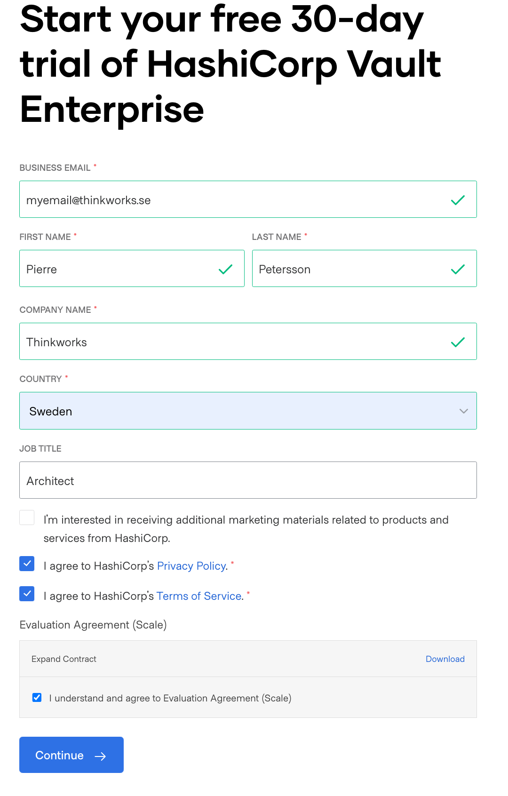
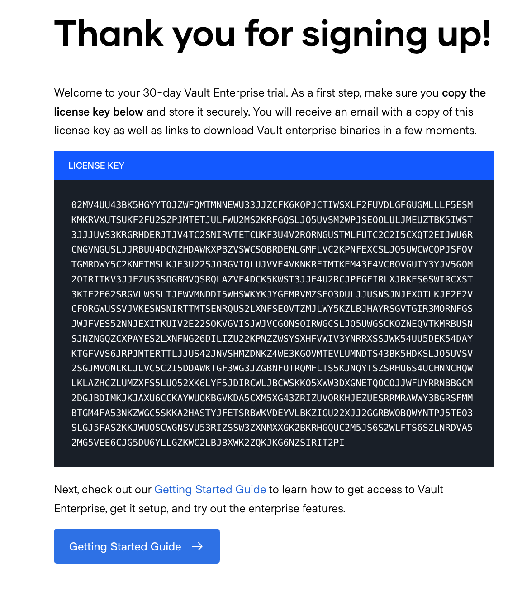
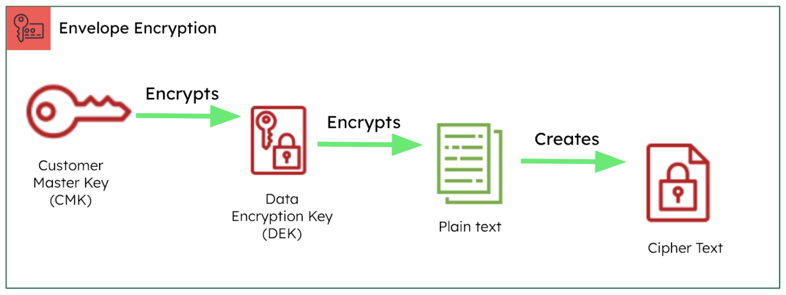
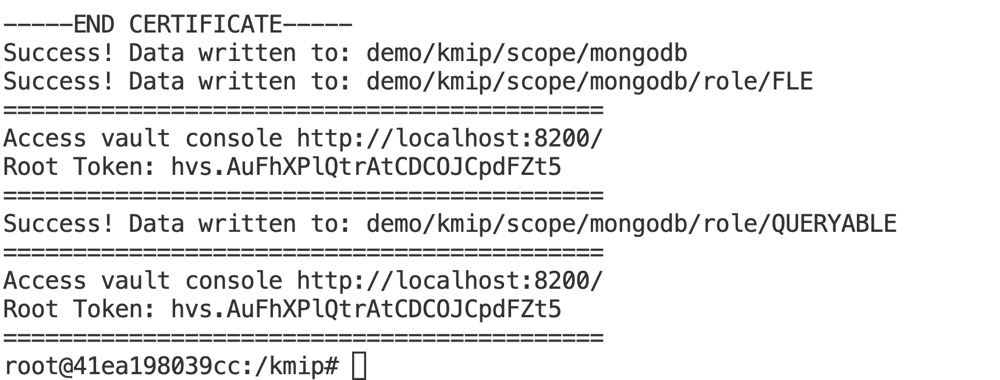
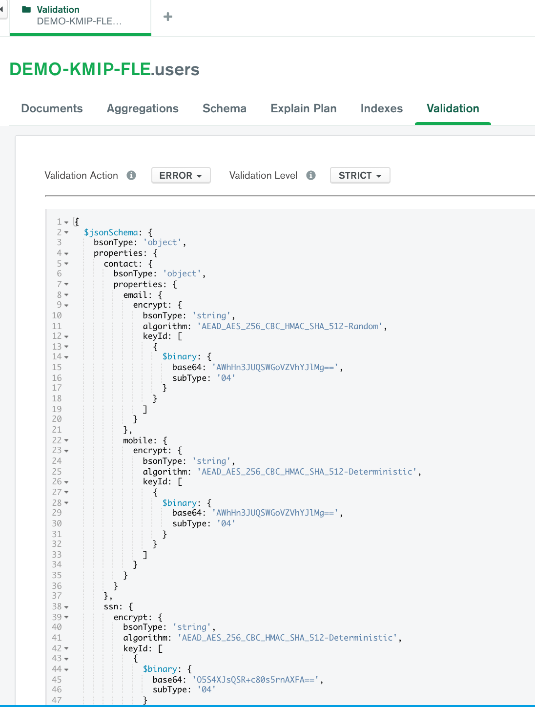
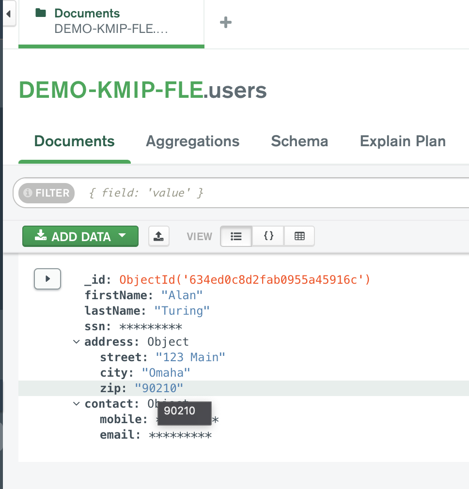
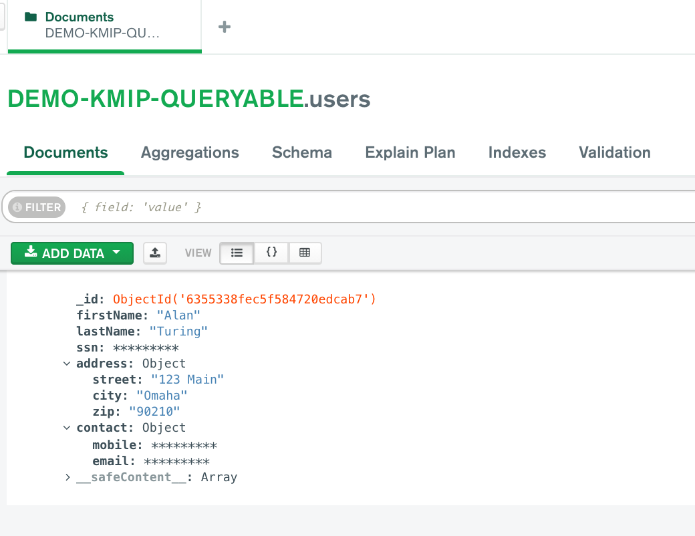
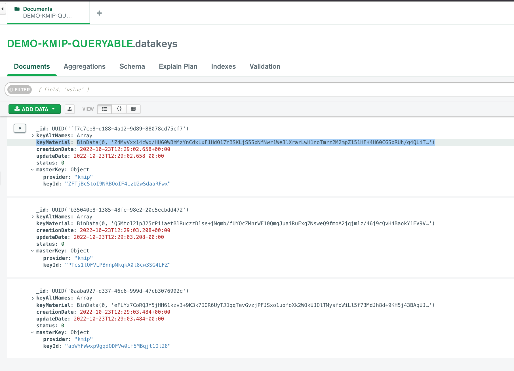
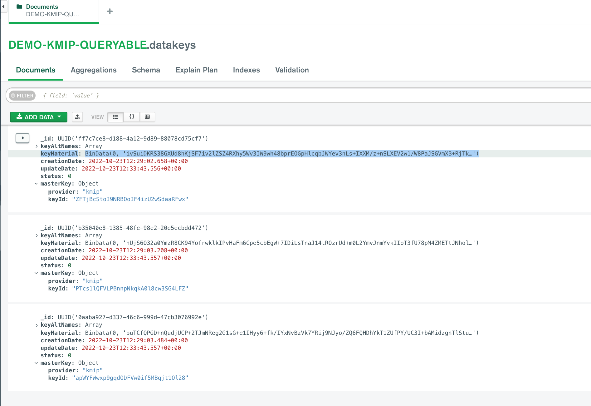

# MongoDB CSFLE and Queryable Encryption with Hashicorp Vault and KMIP

__Automate setup of CSFLE and Queryable Encrption with HashiCorp Vault KMIP Secrets Engine__

__SA Maintainer__: [Pierre Petersson](mailto:pierre.petersson@mongodb.com) <br/>
__Time to setup__: 2 mins <br/>
__Time to execute__: 5 mins <br/>

The automation creates the following:
* Hashicorp Vault Enterprise
* Configures KMIP Secrets Engine
* Configure Scopes, Roles and other configuration
* Configures Certificate to be used to authenticate against Vault
* An test application that inserts a document with where some fields are CSFLE and Queryable Encryption enabled.

# Update vault/license.txt with license key
Request license key from https://www.hashicorp.com/products/vault/trial and then update kmip-with-hashicorp-key-vault/vault/license.txt
<br/>


# Encryption Terminoligy
</br>

__Customer Master Key (CMK)__, is the encryption key used to protect(encrypt) the Data Encryption Keys, which is on the top level of the encryption hierarchy.

__The Data Encryption Key (DEK)__ is used to encrypt the data that is plain text. Once plain text is encrypted by the DEK it will be in cipher text. 

__Plain text data__ is unencrypted information that you wish to protect, 


__Cipher text__ is Encrypted information unreadable by a human or computer without decryption.

__Envelope encryption__ is the practice of encrypting plain text data with a data encryption key (DEK) and then encrypting the data key using the customer master key.

# Update MongoDB Atlas connection string
For FLE: Change String in file kmip-with-hashicorp-key-vault/configuration_fle.py line 3, Replace USER, PASSWORD, CLUSTER NAME with your Atlas Connection String

For Queryable: Change String in file kmip-with-hashicorp-key-vault/configuration_queryable.py line 3, Replace USER, PASSWORD, CLUSTER NAME with your Atlas Connection String

```
connection_uri = "mongodb+srv://<USER>:<PASSWORD>@<CLUSTER-NAME>/?retryWrites=true&w=majority"
```
# Start Docker Container
A prebaked docker image that has HashiCorp Vault installed, and mongodb shared library start container in root of this repo
```
docker run -p 8200:8200 -it -v ${PWD}:/kmip piepet/mongodb-kmip-vault:latest
```
# Start Vault and configure vault
Running below commands will start Vault Server and configure KMIP Secrets engine. Certificates will be generated, vv-client.pem, vv-ca.pem, vv-key.pem. The CSFLE configuration.py will refer to this certificates.


```
cd kmip
# Run this to configure FLE and Queryable Encryption Roles Scopes in HashiCorp Key vault
./start_and_configure_vault.sh -a

# Run this to only configure FLE Roles and Scopes HashiCorp Key vault
./start_and_configure_vault.sh -f

# Run this to only configure Queryable Roles and Scopes HashiCorp Key vault
./start_and_configure_vault.sh -q

```
You can now access the Hashicorp Key Vault console, by going to url http://localhost:8200/ and in shell output you will see the root token if you want to sign in.



# Test KMIP as KMS provider
Python application that inserts a document with CSFLE configured. CSFLE is configured to use HashiCorp Vault KMIP Secrets Engine as KMS provider.

## CSFLE Schema Stored in Database
Will create a database with name DEMO-KMIP-FLE where the keyvault collection and the user collection will be created. The CSFLE schema will be stored in database, as a validation see below.
<br/>


```
cd /kmip/kmip-with-hashicorp-key-vault/
python3.8 vault_encrypt_with_csfle_kmip.py
```

## CSFLE Schema Stored in Client
Will create a database with name DEMO-KMIP-FLE where the keyvault collection and the user collection will be created.
The CSFLE schema will be only on the client side, as a validation see below.

```
cd /kmip/kmip-with-hashicorp-key-vault/
python3.8 vault_encrypt_with_csfle_kmip_client_schema.py
```

You should now see the following in the DEMO-KMIP-FLE.users
<br/>


## Queryable Encryption
Will create a database with name DEMO-KMIP-QUERYABLE where the keyvault collection and the user collection will be created.

```
cd /kmip/kmip-with-hashicorp-key-vault/
python3.8 vault_encrypt_with_queryable_kmip.py
```

You should now see the following in the DEMO-KMIP-QUERYABLE.users
<br/>



The application will automatically encrypt/decrypt the fields defined in the validation schema thats attached to the users collection. Fields that should be shown encrypted are ssn, contact.mobile, contact.email

You should now be able to see in compass that fields that are encrypted have ****** shown as value. 

## Key rotation
Decrypt multiple Data Encryption Keys (DEK) and re-encrypts them with a new Customer Master Key (CMK). Use this method to rotate the CMK that encrypts your DEKs. 

Look at field KeyMaterial in datakeys collection for respective encryptionMode (Queryable or FLE). The KeyMaterial will be replaced with new KeyMaterial. 

Before running rotate:
<br/>


```
## FLE MasterKeys and DEKS
python3.8 rotate_fle.py

## Queryable Encryption MasterKeys and DEKS
python3.8 rotate_queryable.py 
```
After running rotate:



# Cleanup
If you want to rerun setup, delete vault/data folder. only the data folder. Run the following in root of this pov.
```
./cleanup.sh
```

# Additional Resources
## Client-Side Field Level Encryption The Next Generation of Privacy & Security MDBW22 Video </br>
https://www.youtube.com/watch?v=KBMfaEzxNFk

## Whitepaper CSFLE 
https://www.mongodb.com/collateral/field-level-encryption

## CSFLE Multi Cloud Environments MDBW22 Video
https://www.youtube.com/watch?v=bfyxplG1DVg&list=PL4RCxklHWZ9tKWSS21BmtFxOs51f-l1o9&index=33&t=9s

## Queryable Encryption Resources
Docs (very much a WIP): https://www.mongodb.com/docs/upcoming/core/queryable-encryption/ </br>
Blog post: https://www.mongodb.com/blog/post/mongodb-releases-queryable-encryption-preview </br>
Product page & FAQ: https://mongodb.com/products/queryable-encryption </br>

## To build and push docker file
```
docker buildx create --name builder —use
docker buildx build --push --platform linux/amd64,linux/arm64 --tag piepet/mongodb-kmip-vault:latest .
```

